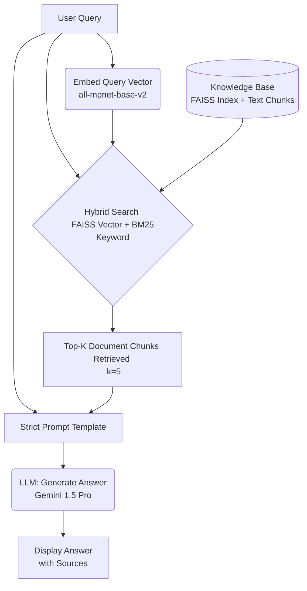

# Building a RAG-Based Documentation Helper: A Capstone Project

Retrieval-Augmented Generation (RAG) systems offer a powerful solution to one of the biggest challenges in working with technical documentation: finding clear, relevant, and contextual answers to user questions. This blog post introduces a working RAG prototype, developed as a capstone project for a Gen AI workshop, that serves as a reference tool for the Transcribe! software documentation. We'll walk through the motivation behind the project, the system's architecture, the implementation journey, and potential next steps for improvement.

## Motivation: Why Build a RAG Documentation Helper?

Transcribe! is a highly regarded tool among musicians and transcribers for its specialized features in slowing down, looping, and analyzing audio. However, like many powerful, niche applications, its documentation presents challenges. Information is spread across a collection of bundled HTML help files and various pages on the main website, including FAQs and overviews. This fragmentation makes finding specific answers quickly a difficult task. Users wanting to know "How do I slow down playback?", "What's the shortcut for adding a section marker?", or "Explain the 'Piano Roll' view." might find themselves navigating complex file structures or struggling with standard keyword searches that don't quite capture their intent or the documentation's specific terminology.

General-purpose chatbots lack the deep, specific knowledge required, while simple keyword search often fails to surface the most relevant information buried within the HTML. The documentation itself, designed for reading, isn't optimized for quick lookups. This is where Retrieval-Augmented Generation comes in. A RAG-based tool can bridge this gap by first intelligently retrieving relevant sections from the actual documentation using modern search techniques, and then employing a Large Language Model (LLM) to synthesize that information into a direct, concise, and contextually relevant answer. This approach promises not only better answers but also grounds those answers in the authoritative source material, increasing user trust.

## Architecture: How the System Is Structured

The core idea is to retrieve information before generating an answer. Our system follows this RAG pattern, orchestrated primarily using the LangChain framework:

When a user poses a query, it's first converted into a numerical representation (an embedding) using the `all-mpnet-base-v2` sentence transformer model. This embedding captures the semantic meaning of the query. Simultaneously, the **raw query text** itself is used by the keyword search component (BM25) within the hybrid search.

The heart of the retrieval process is a hybrid search strategy managed by LangChain's `EnsembleRetriever`. This component queries two different underlying retrievers:
1.  A **FAISS vector store**, which uses the *query embedding* to find chunks semantically similar to the query.
2.  A **BM25 retriever**, which uses the *raw query text* to rank chunks based on keyword relevance (term frequency and inverse document frequency) using the raw text of the documentation.

The results from both retrievers (the top 5 chunks from each, in this implementation) are combined, weighted equally, and deduplicated to produce a final set of contextually relevant document chunks.

These retrieved chunks, along with the original user query, are then inserted into a carefully designed "strict prompt" template. This prompt guides the LLM (Google's Gemini 1.5 Pro) on how to behave: answer concisely, base the answer *only* on the provided context, state when an answer cannot be found, and include source URLs if possible.

Finally, the complete prompt is sent to the LLM via LangChain's `ConversationalRetrievalChain`, which returns the generated answer for display. This entire process ensures the answer is not just generated, but generated based on specific, relevant information pulled directly from the Transcribe! documentation.

## Implementation Walkthrough

The journey from concept to working prototype involved several key steps, implemented within a consolidated Kaggle notebook using Python and leveraging libraries like LangChain, Sentence Transformers, FAISS, and the Google AI API.

**1. Gathering and Preparing the Knowledge Base (Build Phase)**

The foundation of any RAG system is its knowledge base. We started by collecting the necessary documentation, targeting both the bundled HTML help files (hosted online) and specific key pages from the main Transcribe! website. Using Python's `requests` library within a simple web crawler logic, we programmatically fetched the HTML content. The crawler began with seed URLs (the base help site URL and additional specified website pages) and followed internal links discovered within the help site domain, using a queue and a set of visited URLs to manage the process up to a defined page limit (`max_pages_to_crawl`).

Raw HTML isn't ideal for processing, so we employed `BeautifulSoup` to parse the fetched content for each page. A crucial step here was cleaning the HTML – removing superfluous elements like navigation bars, footers, and scripts that wouldn't provide useful context for answering user queries. Importantly, during this cleaning process, we made sure to preserve hyperlinks (`<a>` tags) within the main text, converting them into a `[link text](URL)` format. This allows the final answers to potentially cite specific source pages directly.

Once cleaned, the text content from each page was too long to be effectively used by embedding models. We used LangChain's `RecursiveCharacterTextSplitter` to divide the text into smaller, overlapping chunks (specifically, 256 tokens per chunk with a 50-token overlap). This aims to create semantically meaningful units while ensuring context isn't lost at chunk boundaries. Each chunk also retained metadata indicating its original source URL, essential for traceability.

**2. Embedding and Indexing the Knowledge (Build Phase)**

With the documentation prepared and chunked, the next step was to make it searchable. We used the `SentenceTransformerEmbeddings` class (interfacing with the powerful `all-mpnet-base-v2` model) to convert the text content of each chunk into a high-dimensional vector embedding. These embeddings capture the semantic essence of the text.

To enable efficient searching based on these embeddings, we stored them in a FAISS (Facebook AI Similarity Search) index. FAISS allows for very fast nearest-neighbor searches, finding the chunks whose vector representations are closest in meaning to a query vector.

Recognizing that semantic search alone isn't always perfect (sometimes specific keywords are vital), we also prepared for keyword search. We saved the original `Document` objects (containing the chunk text and metadata) using Python's `pickle` library. This collection of text serves as the corpus for the BM25 algorithm.

These two components – the FAISS index directory and the pickled `Document` list – form our hybrid knowledge base artifacts. In the project workflow, these were generated once in a "Build Run" and saved as a Kaggle Dataset to be loaded efficiently in subsequent runs.

**3. Implementing the Retrieval Strategy (Final Run Phase)**

In the final execution phase, the notebook loads the pre-built FAISS index and the pickled chunks from the Kaggle Dataset. The core retrieval logic uses LangChain's `EnsembleRetriever`. We configured two base retrievers: one using the loaded FAISS index (`FAISS.as_retriever`) set to return the top 5 semantically similar chunks, and another using `BM25Retriever.from_documents` operating on the loaded text chunks, also configured for the top 5 keyword matches. The `EnsembleRetriever` was set to combine these results with equal importance (`weights=[0.5, 0.5]`), providing a balanced hybrid search.

**4. Engineering the Prompt (Final Run Phase)**

Simply feeding retrieved chunks to an LLM isn't enough; guiding the LLM's behavior is critical for a reference tool. We designed a "strict prompt" using LangChain's `PromptTemplate`. This template explicitly instructs the LLM (Gemini 1.5 Pro) to act as a helpful assistant *specifically* for Transcribe!, to answer *only* based on the provided document chunks (`{context}`), to keep answers concise, to clearly state if the provided context doesn't contain the answer, and to include source URLs (`[Source: URL]`) when possible. This ensures the LLM stays grounded and avoids making things up.

**5. Generating the Answer (Final Run Phase)**

The final step uses LangChain's `ConversationalRetrievalChain` to tie everything together. It takes the user's query (`{question}`), passes it to the `EnsembleRetriever` to get relevant context chunks, formats these chunks and the query into the strict prompt, and sends the result to the `ChatGoogleGenerativeAI` model (configured for Gemini 1.5 Pro with a low temperature of 0.1 for factual recall). The chain then returns the LLM's generated answer. For testing and evaluation, the final notebook runs a set of predefined queries non-interactively through this chain, printing the results and demonstrating the end-to-end functionality. An artificial delay (`time.sleep`) was added between these test queries as a practical measure to handle API rate limiting encountered in the Kaggle free-tier environment.

## Conclusions and Future Work

**Project Outcomes**

This capstone project successfully produced a functional RAG prototype demonstrating a significant improvement over traditional methods for querying the Transcribe! documentation. The hybrid search strategy proved effective, retrieving relevant context that allowed the LLM, guided by a strict prompt, to generate accurate and concise answers grounded in the source material. Key successes included the preservation and occasional citation of source links, and the system's ability to gracefully handle both known difficult queries (like listing all commands, where it correctly pointed to the documentation) and queries where the answer wasn't present in the indexed documents. The modularity provided by LangChain facilitated the construction and iteration of the pipeline.

**Challenges Encountered**

The development process wasn't without hurdles. The most significant practical challenge was encountering API rate limits on Kaggle's free tier when testing the QA chain with multiple queries. While adding delays between calls provided a functional workaround, it highlighted the need for more robust handling in a production scenario. Adapting the initial Colab implementation to Kaggle also required careful attention to environment differences, particularly in handling secrets and data paths (using Kaggle Datasets instead of Google Drive). Finally, while `BeautifulSoup` automated much of the HTML cleaning, some manual inspection and tuning were needed to ensure optimal content extraction from the varied source pages.

**Looking Ahead**

While this prototype is effective, several avenues exist for future enhancement. Implementing more sophisticated rate limit handling, such as exponential backoff and retries, would improve robustness and efficiency. Experimenting with different embedding models (like Cohere or Voyage) or LLMs could yield performance improvements or cost benefits. For certain types of queries, particularly those seeking specific commands or shortcuts, extracting this information into a structured format during preprocessing might allow for faster, more direct lookups, potentially bypassing the LLM entirely. Advanced retrieval techniques like query transformation or result re-ranking could also be explored. Finally, packaging the RAG chain into an interactive web UI (using Streamlit or Gradio) would make the tool directly usable for end-users seeking help with Transcribe!. Implementing a formal evaluation framework using tools like Ragas would also allow for more quantitative assessment of the system's performance.

In conclusion, this RAG prototype effectively demonstrates how generative AI, when thoughtfully combined with retrieval techniques and prompt engineering, can transform static technical documentation into a far more accessible and responsive knowledge resource. It serves as a valuable starting point for building truly helpful, context-aware documentation assistants.
